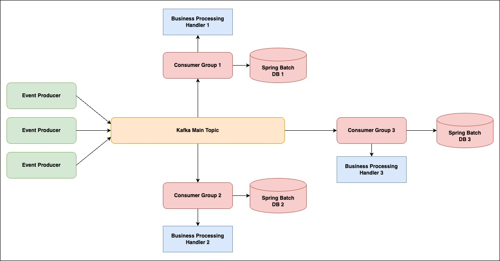

# Handle Error Patterns - Event-Driven Architecture

### Pattern 1: Use spring batch to handle event

     
    

### Pattern 2: Use retry topic for each consumer group

### Pattern 3: Just ignore error in we can