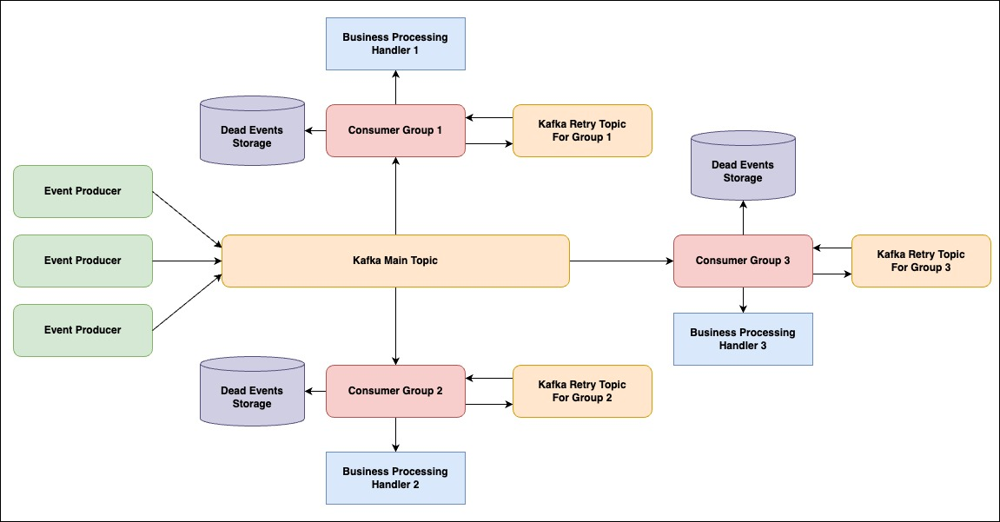

# Handle Error Patterns - Event-Driven Architecture

### Pattern 1: Use spring batch to handle event

     
    

#### Pros

- The event handle logic is totally isolated among all consumer groups.
- It's very easy to implement because the Spring Framework already support everything.
- It's easy to scale-out event handle note, because the database is separate statefulset set.

#### Cons

- Must use a separate database to store and control job status for Spring Batch framework
- It's convenience if the consumer component has already own database. Spring batch can use this DB instance too.

### Pattern 2: Use retry topic for each consumer group

     
    

#### Pros

- The event handle logic is totally isolated among all consumer groups.
- It's easy to scale-out event handle note, because each consumer groups use different retry topic.
- Do not need use statefulset database to manage state of event processing job.

#### Cons

- Must use different retry topics for each consumer groups to prevent duplicate event of other groups.
- Must setup dead events storage for save, monitor and investigate the dead event to ensure the system consistent data.

### Pattern 3: Just ignore error if we can

- In some cases, the business logic of the system can accept some lose data and just focus on improve the latency time
- With these cases, just ignore the error when handling event and focus on improve the response time of system.