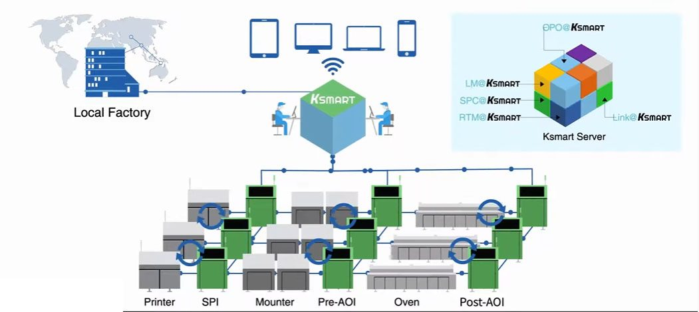

# KSMart Solution

## 1. Overview

The KSMART smart factory solutions represents a revolution in process optimization to ensure the highest standards of quality and reliability on the factory line.
KSMART collects inspection and measurement data from all equipment through its 
KSMART server to utilize anywhere in the network through a high-intuitive user interface for defect detection, real-time optimization, 
enhanced decision making and traceability to improve metrics, increase board quality and lower costs by eliminating variance, false calls and escapes.

     
    
     
    [https://youtu.be/RYJTLqn7nYU?si=LVJqkl1PpS9o3pb5](https://youtu.be/RYJTLqn7nYU?si=LVJqkl1PpS9o3pb5)

## 3. Key Features

### Reliable 3D data-based multi-line statistical process control

Based on its world-class True 3D inspection technology, KSMART provides a cross-platform multi-line process analysis application 
that includes production performance analysis by job, PCB, components, and product. It also provides detailed inspection results with visual graphics 
and accumulated statistics through deep inspection data analysis tools including charts, histograms, and more. Users can instantly analyze data visualized 
with relevant indicators to compare board performance and identify process deviations. 
It helps users to convert data into knowledge for effective and quality-driven actions.

### Real-time monitoring and Job fine-tuning with minimum downtime

Users can monitor overall production performance in real-time and get notified with KSMART’s easily configurable notification features. 
With OEE, furthermore, users can monitor production line information such as machine utilization, production monitoring chart, and a line monitoring dashboard. 
Based on Koh Young Offline Program Optimizer, users can optimize job programs with historical data of the components by loading and debugging identified defects, 
which enables measurement-based fine-tuning through simulations with accumulated historical data with minimum downtime.

### Job and user-level management

Central management for the source of programs and libraries used by all equipment is possible with user authority control in a single management system.
It ensures consistent inspection performance for all inspection systems with optimized central data while maximizing productivity.

### 3D data-based SPI-AOI communication solution, and more

With quality control capabilities and a full lineup of integrated inspection systems, KSMART times everything together: 
SPI, AOI, and production machine with AI-powered production analysis for fully-automated control that boosts productivity while minimizing costs.

